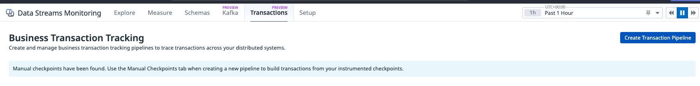
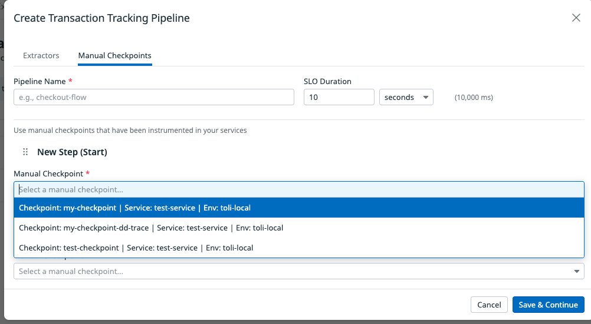

# Datadog Checkpoints

A simple TypeScript app that sends sample/test checkpoints to Datadog's [Data Streams Monitoring](https://docs.datadoghq.com/data_streams/) for Business Transaction Tracking.

Once checkpoints are sent, they appear under **Data Streams Monitoring > Transactions > Business Transaction Tracking** in Datadog:



## Prerequisites

- [Node.js](https://nodejs.org/) (v16+)
- A [Datadog API key](https://docs.datadoghq.com/account_management/api-app-keys/)

## Setup

```bash
# Install dependencies
npm install
```

## Configuration

| Environment Variable | Description | Default |
|---|---|---|
| `DD_API_KEY` | **(Required)** Your Datadog API key | — |
| `DD_SERVICE` | Service name reported to Datadog | `datadog-checkpoints-app` |
| `DD_ENV` | Environment name reported to Datadog | `local` |

## Option 1: Direct HTTP API

Sends checkpoints directly to the Datadog pipeline stats API endpoint using HTTPS. No Datadog Agent required — just an API key.

### Usage

```bash
export DD_API_KEY="your-api-key"

# Send a checkpoint with default name
npm run send

# Send a checkpoint with a custom name
npm run send -- my-checkpoint

# Send a checkpoint with a custom name and transaction ID
npm run send -- my-checkpoint my-transaction-123
```

### Example output

```
Sending checkpoint to Datadog...
  Transaction ID: a1b2c3d4-e5f6-7890-abcd-ef1234567890
  Checkpoint: test-checkpoint
  Service: datadog-checkpoints-app
  Environment: local
  Status: 202
  Response:
Checkpoint sent successfully!
```

### How it works

1. Builds a checkpoint payload containing a transaction ID, checkpoint name, and nanosecond-precision timestamp
2. Gzip-compresses the JSON payload
3. Sends it via HTTPS POST to `https://trace.agent.us3.datadoghq.com/api/v0.1/pipeline_stats`

## Option 2: Using dd-trace

Uses the official [`dd-trace`](https://github.com/DataDog/dd-trace-js) library with the `trackTransaction` API from the Data Streams Monitoring checkpointer. This is the recommended approach for production applications that already use `dd-trace`.

### Prerequisites (dd-trace)

A running [Datadog Agent](https://docs.datadoghq.com/agent/) is required. The `dd-trace` library sends data to the local agent, which forwards it to Datadog.

You can run the agent locally with Docker:

```bash
docker run -d \
  --name dd-agent \
  -e DD_API_KEY="your-api-key" \
  -e DD_SITE="us3.datadoghq.com" \
  -e DD_APM_ENABLED=true \
  -e DD_DATA_STREAMS_ENABLED=true \
  -p 8126:8126 \
  gcr.io/datadoghq/agent:latest
```

### Usage

```bash
export DD_API_KEY="your-api-key"

# Send a checkpoint with default name
npm run send:ddtrace

# Send a checkpoint with a custom name
npm run send:ddtrace -- my-checkpoint

# Send a checkpoint with a custom name and transaction ID
npm run send:ddtrace -- my-checkpoint my-transaction-123
```

### Example output

```
Sending checkpoint via dd-trace...
  Transaction ID: a1b2c3d4-e5f6-7890-abcd-ef1234567890
  Checkpoint: test-checkpoint
  Service: datadog-checkpoints-app
  Environment: local
  Checkpoint tracked on span
Checkpoint sent successfully!
Waiting for tracer to flush...
```

### How it works

1. Initialises `dd-trace` with `dsmEnabled: true` to enable Data Streams Monitoring
2. Creates a trace span and calls `tracer.dataStreamsCheckpointer.trackTransaction()` to record the checkpoint
3. The tracer sends the data to the local Datadog Agent, which forwards it to Datadog

### Additional dd-trace environment variables

| Environment Variable | Description | Default |
|---|---|---|
| `DD_AGENT_HOST` | Datadog Agent hostname | `localhost` |
| `DD_TRACE_AGENT_PORT` | Datadog Agent trace port | `8126` |
| `DD_DATA_STREAMS_ENABLED` | Enable DSM (alternative to code config) | `false` |

## Testing with dd-trace

To test the `dd-trace` approach end-to-end:

### 1. Start a Datadog Agent

```bash
docker run -d \
  --name dd-agent \
  -e DD_API_KEY="your-api-key" \
  -e DD_SITE="us3.datadoghq.com" \
  -e DD_APM_ENABLED=true \
  -e DD_DATA_STREAMS_ENABLED=true \
  -p 8126:8126 \
  gcr.io/datadoghq/agent:latest
```

### 2. Verify the agent is running

```bash
curl -s http://localhost:8126/info | head
```

### 3. Send a test checkpoint

```bash
export DD_API_KEY="your-api-key"
npm run send:ddtrace -- order-placed order-123
```

### 4. Send a second checkpoint for the same transaction

```bash
npm run send:ddtrace -- order-completed order-123
```

### 5. Verify in Datadog

1. Go to **Data Streams Monitoring > Transactions** in the Datadog UI
2. You should see your manual checkpoints listed
3. Click **Create Transaction Pipeline** to build a pipeline from your checkpoints

### Testing without a Datadog Agent

If you don't have a Datadog Agent running, use **Option 1** (Direct HTTP API) instead — it sends checkpoints directly to Datadog without needing an agent:

```bash
export DD_API_KEY="your-api-key"
npm run send -- order-placed order-123
npm run send -- order-completed order-123
```

## Build

```bash
# Compile TypeScript to JavaScript
npm run build

# Run the compiled version
node dist/send-checkpoint.js
node dist/send-checkpoint-ddtrace.js
```

## Creating a Transaction Pipeline

Once your checkpoints are being sent, you can create a Transaction Tracking Pipeline in Datadog:

1. Go to **Data Streams Monitoring > Transactions**
2. Click **Create Transaction Pipeline**
3. Select the **Manual Checkpoints** tab
4. Give your pipeline a name and set an SLO duration
5. Select your checkpoints from the dropdown for the start and end steps


